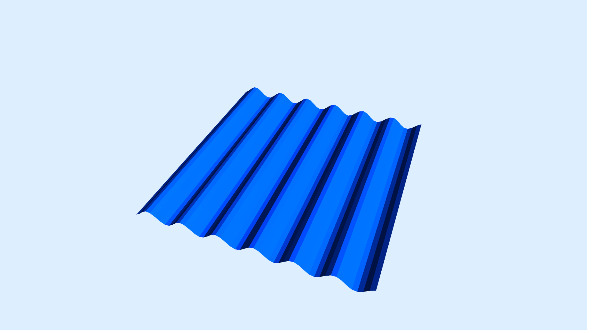

# Svelte Math Graph

> **Warning!** This is an experimental work-in-progress library that I am developing for fun. Features, configuration and documentation are lacking. This may or may not turn into a proper library eventually, but currently this should only be used for experimentation.

**Svelte Math Graph (SMG)** is a component library for creating mathematical graphs and visualizations with a declarative component-oriented API that focuses on ease of use, configurability, and extensibility.

Graphs are built using components like `<CoordinateAxes />` and `<Curve />`. Each component can be configured using props, and the graph will automatically react to any changes to these props.

Under the hood, SMG uses [three.js](https://threejs.org/) for the rendering. All of the boilerplate and technical overhead is just hidden from the user into the scripts of the components, which is very similar to what libraries like [Svelte Cubed](https://svelte-cubed.vercel.app/) and [svelthree](https://svelthree.dev/) do. This means that you get the capabilities and performance of three.js with a readable, reactive, and declarative API that can even be extended with your own components if necessary.

Parsing mathematical expressions is done with [math.js](https://mathjs.org/). Note that this is currently quite limited, and things like solving actual equations is not supported. This will hopefully change in the future.

## Usage example: Animated 3D sine wave

**Note:** This library isn't on NPM yet, so you will have to clone it if you want to test it out.

To render a 3D surface we will use the `<Surface />` component. It takes in a mathematical function and variables as props. Note that variables like *x*, *y*, *z* etc. have a default configuration, so we don't have to manually declare them.

In order to animate the graph, we will create a variable called `time`, and update it every frame using `requestAnimationFrame` and `performance.now`. We will later pass in the time variable to `<Surface />` as *t*, and the graph will automatically update whenever `time` changes, thanks to Svelte's reactivity system.

In the template of the file, we create a graph, a camera, and a directional light. The `<Graph />` component is the main container for all other components, and it initializes the canvas and the renderer. The camera handles the actual rendering part. The light makes sure the meshes are visible, as they would appear dark with the default materials.

Finally, we create the `<Surface />` component that handles all of the complex math parsing and 3D mesh generation. We pass in the function $f(x, y) = \sin(x + 10t)$ along with the `time` variable, and give it a blue color.

```svelte
<script>
	import { DirectionalLight, Graph, PerspectiveCamera, Surface } from 'svelte-math-graph';
	import { onMount } from 'svelte';

	let time = 0;

	onMount(() => requestAnimationFrame(updateTime));

	function updateTime() {
		requestAnimationFrame(updateTime);
		time = performance.now() / 1000;
	}
</script>

<Graph backgroundColor={0xddeeff}>
	<PerspectiveCamera position={[20, 50, 50]} lookAt={[0, 0, 0]} />
	<DirectionalLight intensity={2} position={[0.75, 1, 0.75]} target={[0, 0, 0]} />
	<Surface surfaceFunction={'f(x, y) = sin(x + 10t)'} variables={{ t: { value: time } }} color={0x0044ff} />
</Graph>
```

This produces the following result:

https://user-images.githubusercontent.com/57632562/211108736-e24fe721-4a65-4858-a5c3-488ac46a2caa.mp4

<details>
	<summary>An image if the video doesn't show up</summary>


</details>
